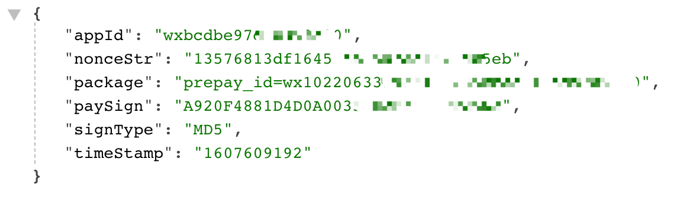
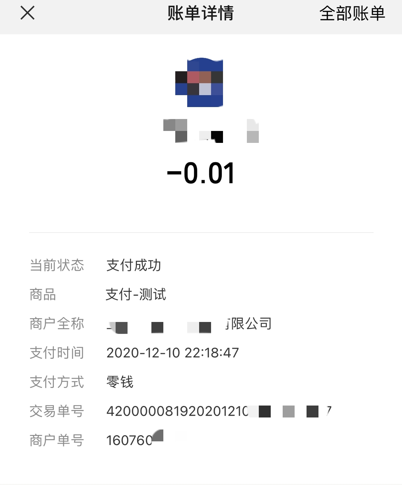

# 微信支付flask后端

## 准备工作
1、商户号：一串数字、需要自行申请，需要一些证明材料

2、小程序ID：已经认证并且加入支付功能，需提前发布以便商户审核通过

3、商户KEY：在商户平台自己设置，MD5 32位加密即可

4、一些参数

```python
post_data = {
    'appid': self.appid,  # 小程序ID
    'mch_id': self.mch_id,  # 商户号
    'nonce_str': get_nonce_str(),  # 随机字符串
    'body': self.pay_data.get('body'),  # 商品描述
    'out_trade_no': str(int(time.time())),  # 商户订单号
    'total_fee': self.pay_data.get('total_fee'),  # 订单总金额，单位为分
    'spbill_create_ip': self.spbill_create_ip,  # 终端 IP
    'notify_url': self.notify_url,  # 通知地址
    'trade_type': 'JSAPI',  # 交易类型，小程序 JSAPI
    'openid': self.pay_data.get('openid')  # 获取请求参数中的用户openid JSAPI支付必须传
}
```

## 配置信息

编辑 wxpay.py 文件

```python
def __init__(self, pay_data):
    self.url = 'https://api.mch.weixin.qq.com/pay/unifiedorder'
    self.appid = 'xxxxx'  # 微信分配的小程序ID
    self.mch_id = 'xxxx'  # 商户号
    self.notify_url = 'https://xxxx/wxpay/notify'  # 通知地址
    self.spbill_create_ip = socket.gethostbyname(socket.gethostname())  # 获取本机ip
    self.merchant_key = 'xxxxxxxxx'  # 商户KEY，修改为自己的
    self.pay_data = pay_data
```

编辑 app.py 文件

```python
pay_data = {
    'body': '支付-测试',  # 商品描述
    'attach': '附加数据',  # 附加数据
    'total_fee': '1',  # 订单总金额，单位为分
    'openid': request.args.get('openid')
}
```

## 签名算法

[官方文档](https://pay.weixin.qq.com/wiki/doc/api/wxa/wxa_api.php?chapter=4_3 )

1、首先将所要发送的参数进行 ASCII 码从小到大排序，拼接成url参数形式，如：stringA="appid=wxd930ea5d5a258f4f&body=test&device_info=1000&mch_id=10000100&nonce_str=ibuaiVcKdpRxkhJA"

2、将商户32位key拼接 stringSignTemp=stringA+"&key=192006250b4c09247ec02edce69f6a2d" 

3、MD5加密，并转化为大写

 代码如下
```python
def create_sign(self, pay_data):
    stringA = '&'.join(["{0}={1}".format(k, pay_data.get(k)) for k in sorted(pay_data)])
    stringSignTemp = '{0}&key={1}'.format(stringA, self.merchant_key).encode('utf-8')
    sign = hashlib.md5(stringSignTemp).hexdigest()
    return sign.upper()
```
## 拼接XML
```python
def dict_to_xml(dict_data):
    xml = ["<xml>"]
    for k, v in dict_data.items():
        xml.append("<{0}>{1}</{0}>".format(k, v))
    xml.append("</xml>")
    return "".join(xml)
```
在使用上述代码进行 xml 拼接的时候，prepay_id 返回数据为空。通过搜索，发现一种原因是终端 ip 的原因，所以修改为 socket  获取终端 ip。

## 统一下单

```python
def get_pay_info(self):
    """
    支付统一下单
    :return:
    """
    # 调用签名函数

    post_data = {
        'appid': self.appid,  # 小程序ID
        'mch_id': self.mch_id,  # 商户号
        'attach': self.pay_data.get('attach'),  # 附加数据
        'nonce_str': get_nonce_str(),  # 随机字符串
        'body': self.pay_data.get('body'),  # 商品描述
        'out_trade_no': str(int(time.time())),  # 商户订单号
        'total_fee': self.pay_data.get('total_fee'),  # 订单总金额，单位为分
        'spbill_create_ip': self.spbill_create_ip,  # 终端 IP
        'notify_url': self.notify_url,  # 通知地址
        'trade_type': 'JSAPI',  # 交易类型，小程序 JSAPI
        'openid': self.pay_data.get('openid')
    }
    sign = self.create_sign(post_data)
    post_data['sign'] = sign

    xml = dict_to_xml(post_data)

    # 统一下单接口请求
    r = requests.post(self.url, data=xml.encode("utf-8"))
    r.encoding = "utf-8"
    res = xml_to_dict(r.text)
    err_code_des = res.get('err_code_des')
    # 出错信息
    if err_code_des:
        return {'code': 40001, 'msg': err_code_des}
    prepay_id = res.get('prepay_id')

    return self.re_sign(post_data, prepay_id)
```
基于[代码](https://github.com/ilyq/wxpay) 进行了适当的修改，在此感谢。

## 效果图




